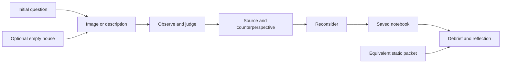

# Enhanced prompt

Read the repository at https://github.com/wagy113/early-Christian-house-gathering-Sol-5.6-Blender before recommending changes. Inspect its documentation, implementation, educational content, tests, and all six featured images. Identify the exact revision inspected. Separate observations from inferences and proposals; do not claim to have run software or tested learning outcomes unless you have.

Act as a learning designer, a critical reader of early Christian historical evidence, and a practical product reviewer. Redesign this project as an experience that leads to an evidence-based written reflection. Preserve what is compelling about the six images. Treat Blender and 3D characters as optional means, never as required deliverables. Compare an image-led experience, a simple empty house with image encounters, and a full 3D simulation; recommend one with explicit reasons and a fallback.

First construct a demanding 100-point rubric for the quality and completeness of the remedy plan. Freeze its criteria before drafting the plan. Require repository-specific diagnosis, historically responsible interpretation, meaningful learner agency, purposeful use of every image, a complete learner journey, reflection and assessment, accessibility, feasible implementation, and observable validation. Distinguish this plan-quality rubric from a separate 100-point rubric for student reflection.

Then apply this prompt to produce a concrete remedy plan. State the intended learners, duration, and assumptions. Define measurable learning outcomes and map them to encounters, learner choices, source evidence, and reflection. Include a complete six-image storyboard, at least one fully written encounter with choices and consequences, an evidence-versus-reconstruction scheme, a debrief, an assignment ready for students, a student rubric, and an instructor guide. Choices must expose a meaningful tension or change the learner's interpretation; avoid decorative clicking, moral scores, stereotyped characters, and pretending we can reproduce ancient lived experience.

Verify consequential historical and pedagogical claims with accessible primary or authoritative sources. Bound the place and period. Do not flatten different early Christian communities into one universal ritual. Label fictional dialogue and uncertain reconstructions clearly. Explain what the images can evoke and what they cannot establish.

Specify what to keep, repair, remove from the core experience, and defer in this exact repository. Give an ordered implementation backlog, a small first prototype, technical and instructional acceptance criteria, and a pilot with decision thresholds. Preserve student writing through failure and provide an equivalent accessible path. Include a reasoned keep-or-drop gate for the empty-house option.

Review the draft against the frozen plan rubric, repair every remediable omission, and record actual review findings and revisions. Aim for 100/100 on documented plan requirements without inventing external validation or asserting perfection. Identify any remaining implementation, expert-review, or student-pilot work separately. Deliver one self-contained Markdown file, beginning with this enhanced prompt, followed by the rubric, remedy plan, sources, and final evidence-linked audit. Do not implement or publish the redesigned site as part of this planning task.

---

## 1. Plan-quality rubric, fixed before drafting (100 points)

Each row contains two requirements worth five points each. Award 5 for an explicit, usable, traceable treatment; 3 for a usable but incomplete treatment; 1 for a mention without operational detail; 0 for absence or contradiction. No points for presentation polish alone. A fabricated source, invented test result, or unsupported claim of proven effectiveness prevents a passing review regardless of the numeric total. The target is 100/100 for the written plan's completeness; implementation and learning effectiveness require separate evidence.

| Criterion | Requirement A (5 points) | Requirement B (5 points) | Maximum |
|---|---|---|---:|
| R1. Repository diagnosis | Identify revision, actual files, and observed failures or limitations. | Connect each major finding to a specific remedy; distinguish inspection from execution. | 10 |
| R2. Historical responsibility | Bound time/place and connect consequential claims to verified sources. | Label evidence, interpretation, and invention; address uncertainty and misleading imagery. | 10 |
| R3. Learning alignment | State audience, duration, and observable learning outcomes. | Map outcomes to encounters, decisions, and assessable reflection evidence. | 10 |
| R4. Experiential design | Provide a complete sequence with meaningful choices and interpretive consequences. | Fully script one encounter and explain feedback, revision, and debrief. | 10 |
| R5. Six-image reuse | Inspect and give each exact image a distinct instructional purpose. | Supply all six encounter briefs and image-specific limitations/corrections. | 10 |
| R6. Reflection and assessment | Supply an assignment requiring specific experiences, sources, and changed thinking. | Supply a separate student rubric totaling 100 with clear performance anchors. | 10 |
| R7. Delivery decision | Compare image-led, empty-house, and full-3D options against learning needs. | Choose a default, equivalent fallback, and observable gate for retaining 3D. | 10 |
| R8. Access and learner care | Specify equivalent keyboard, screen-reader, mobile, and low-bandwidth participation. | Preserve writing and include respectful participation, clear fiction labels, and instructor facilitation. | 10 |
| R9. Implementation | Tie an ordered backlog to actual repository files and bounded effort. | Define a small prototype, state/data needs, and technical acceptance checks. | 10 |
| R10. Validation and candor | Specify a feasible pilot, learning indicators, and revise/stop thresholds. | Record actual review revisions, evidence-linked scoring, and unresolved external validation. | 10 |
| **Total** | | | **100** |

---

## 2. Recommended remedy

**Build an image-led historical inquiry called _At the Threshold: Belonging in an Early Christian Gathering_. Keep the six images. Make a simple empty house an optional orientation layer. Stop investing in 3D people for this version.**

The central question is: **What did belonging to this gathering require, and who carried its costs?** Students should leave with an argument they have had to revise, rather than a checklist of six objects they have opened.

Your instinct about retaining the house and replacing its people with images is sound. A house can make thresholds, access, and distance intelligible; these six images can make particular encounters worth attending to. Neither needs to look like a modern game. However, merely putting the same information panels inside an empty house would preserve the present educational weakness. The improvement comes from the sequence: **notice → make a provisional judgment → encounter evidence or another perspective → reconsider → explain**.

“Authentic” here means disciplined historical inquiry into a carefully bounded reconstruction. It does not mean that students have experienced ancient poverty, slavery, worship, or persecution. The emotional invitation comes from the images and situations; the intellectual responsibility comes from sources, uncertainty, and reflection.

This is a completed design proposal dated **October 3, 2026**. It is not an implemented redesign or a report of student results.

For a quick reading, start with this recommendation, the six encounters in Section 6, and the complete meal example in Section 7. Sections 8–9 supply the assignment; Sections 11–12 are the build and pilot handoff. Section 14 records the final rubric audit.

### The delivery choice

| Option | Contribution to learning | Cost or weakness | Decision |
|---|---|---|---|
| Six image encounters, with a small static house diagram | Makes faces, gestures, competing interpretations, and sources immediately accessible. Supports a coherent sequence and writing. | Needs strong scenario writing to avoid becoming a slideshow with questions. | **Default for version 1.** |
| Empty house with selectable encounter locations | Can help students reason about access, visibility, and the relationship between entry and gathering spaces. | Navigation can consume attention; invented architecture may acquire unwarranted authority. | Optional enhancement after the image version works. |
| Full 3D house and animated people | Potentially useful if bodily movement and spatial negotiation become explicit learning outcomes. | Considerable production work and accessibility burden; the present objectives do not require it. | Defer indefinitely unless a future learning need justifies it. |

For the optional house, use either a static cutaway or three empty, prerendered room views. Open each image as a normal, readable encounter page. Do not place flat portraits on moving 3D bodies. Keep “Continue the story” and a six-item contents list available at all times. The same encounter data, sources, notes, and progress must work with or without the house.

Do not commission new renders before proving the meal encounter in Section 7. A diagram and the existing images are sufficient for that prototype.

## 3. What the repository actually does

Reviewed revision: [`f2fc8c5922ee9ab9d895ad1d07c6518eeb37ed49`][repo]. I read the README, React implementation, styles, package/configuration files, both deployment workflows, and the overview's brief, storyboard, and HTML. I visually inspected all six full-size evidence images, the panorama contact sheet, and two Blender previews. The repository tree has no dedicated test files or test script. I did not open the `.blend` files, execute the application, render a video, or conduct a browser usability test.

The current website is **not a live Blender simulation**. [`src/App.jsx`][app] wraps three panorama textures around a Three.js sphere and overlays buttons. The 44,149,560-byte GLB exists in the repository, but this component does not load it. Consequently, removing the model alone would not fix the learner experience or eliminate its WebGL dependency.

| Finding from inspection | Educational or technical implication | Specific remedy |
|---|---|---|
| The six entries in `evidence` contain an image, explanation, and question, but no source citation or distinction between depiction and evidence. | A compelling modern reconstruction is presented as if it were historical evidence. | Rename these “encounters”; pair each with a source card and an image-limit note. |
| `discover()` marks an item found when opened; `EvidenceDialog` has no response input. | The visible success condition measures clicks. An interpretation question alone does not capture reflection. | Separate visited, source-reviewed, and note-recorded states. Save a small learning trail. |
| `step()` changes `selected` without updating `found`. | Reading all six through Next/Previous can leave the completion counter below six. This follows from the source code; it was not browser-reproduced here. | Route every navigation method through one encounter-opening action; derive progress from the same state. |
| Several questions presuppose benefits: care makes a community attractive, meals offer something civic ceremonies cannot. | Students can repeat the implied conclusion without testing it. | Ask whose experience supports a claim, whose complicates it, and what the source cannot establish. |
| The “Field notebook” is a list; completion only tells students to return to Canvas. | There is no recorded bridge from the experience to writing. | Add saved observations, decisions, revisions, and export; give the actual assignment and submission instructions. |
| The panoramas contain simple figures; the close images contain detailed people and different lighting. | Switching between these visual languages can disrupt continuity. This is a design judgment based on the inspected images. | Make the detailed images the primary experience; simplify the house if retained. |
| Dialogs declare `aria-modal`, but code lacks focus placement/trapping/restoration and an accessible dialog name. `evidence-title` is not connected by `aria-labelledby`. | Keyboard and assistive-technology access require more than the existing role attribute. | Prefer page sections; use a native modal dialog with proper labeling only for optional enlargement. [W3C guidance][S8]. |
| Storage reads catch parsing errors but do not validate the stored type; writes/removals are unguarded. | Valid JSON such as `null` can still break assumptions; blocked/full storage can interrupt progress. | Validate versioned state, catch storage failure, preserve the live draft, and expose export. |
| `Suspense` has a null fallback; there is no explicit failed-WebGL/failed-texture alternative in the app. | A rendering problem has no instructional recovery path. | Load the text/image experience independently; keep an always-available linear route. |
| Both Pages workflows trigger on `main` and use the same concurrency group, while one builds Vite and the other Jekyll. | There are competing deployment routes. This is a maintainability risk, not proof of the current failure. | Retain one Vite-to-`dist` deployment workflow. |

There are also useful foundations: concise content, six attractive images, a visible alternative evidence list, keyboard look controls, reduced-motion CSS, relative Vite base configuration, and no runtime account or database requirement. Preserve that simplicity.

The public Actions API reported a [successful Vite deployment for this revision][deploy-success] and a [cancelled Jekyll run][deploy-cancelled]. I therefore do **not** diagnose the current site as undeployed. A successful build also does not establish that an activity teaches effectively.

## 4. Learning contract and alignment

**Audience:** introductory undergraduate history, early Christianity, or religion students. This matches the undergraduate audience in the repository's overview brief. Assume no prior knowledge of Roman domestic architecture. Provide a short glossary: assembly, patron/benefactor, enslaved person, freed person, Eucharist, and primary source.

**Format:** individual exploration, with an optional paired debrief. Allow approximately **40–45 minutes for the experience**, followed by **35–50 minutes for a 600–800-word reflection**. These are planning estimates to revise after the pilot, not mandatory timers.

**Student role:** a present-day investigator invited to consider a fictional gathering. Students can advise a character or evaluate an interpretation. They do not impersonate an enslaved person, determine who deserves to survive, or perform a religious rite.

| Outcome | What the student does | Encounter and evidence | What the reflection must demonstrate |
|---|---|---|---|
| O1. Distinguish depiction, testimony, and inference. | Identify one visible detail, one source-supported claim, and one unresolved question. | All six; particularly status and the shrine. | Explain why an image detail is not proof of ancient practice. |
| O2. Explain a tension in belonging. | Compare at least two perspectives on access, resources, or authority. | Meal, status, care; Pauline and Justin source cards. | Connect a practice to both an opportunity and a cost. |
| O3. Read a source in context. | Identify speaker, audience/purpose, and a time/place limit for a claim. | Reading and pressure; Justin and Pliny/Trajan. | Use two primary texts without merging their settings into one event. |
| O4. Evaluate and revise a judgment. | Save an initial recommendation, consider a counterargument, then revise or retain it with reasons. | Letter, meal, or care. | Show an identifiable before/after change in reasoning, including justified continuity. |
| O5. Transfer a method of inquiry. | Propose what evidence would be needed for a new case. | Final unfamiliar-community prompt. | State a bounded insight and a question that avoids a simplistic ancient/modern analogy. |

The reflection sequence is informed by Ash and Clayton's DEAL approach: describe an experience, examine it against learning objectives, and articulate learning that informs future action. Its application here is a design choice; their article does not validate this particular historical simulation. [Ash and Clayton, 2009, pp. 40–43][S7].

## 5. Historical boundaries and source treatment

Use **a fictional household gathering in Rome around AD 160** as the scenario anchor. This narrows the current AD 150–250 “Roman world” frame. The date and house are instructional choices; no source identifies this particular gathering. The illustrations evoke a household with substantial space and resources, not a representative home for every Christian.

The six scenes form a curated investigation, not a claimed universal order of worship. The food scene does not establish the relationship between a household meal and Eucharistic practice. The wider source packet deliberately includes earlier and geographically different testimony; those differences remain visible.

### The source cards

Every card displays author/text, passage, approximate historical setting, genre/purpose, a short paraphrase, a link, and a sentence beginning “This does not establish…”. Place the relevant card beside the encounter. Preserve these fields in the downloadable packet.

| ID | Verified text or scholarship | What it can support in this activity | Limit students should see |
|---|---|---|---|
| S1 | [Justin, *First Apology* 65–67][S1]; mid-second-century apologetic presentation associated with Rome. | Reading, prayer, Eucharistic practice, and organized assistance appear in Justin's account. | A defense addressed to outsiders is a selective presentation; it is not a transcript or house plan. Chapter 66 also describes participation boundaries. |
| S2 | [1 Corinthians 11:17–34][S2]; Paul's corrective letter to a first-century Corinthian community. | His criticism of unequal eating complicates an uncomplicated picture of fellowship. | Earlier Corinth is a comparison, not direct evidence for the fictional Roman household. An instruction does not prove compliance. |
| S3 | [Romans 16:1–5][S3]; first-century greetings and commendation. | Phoebe, Prisca, Aquila, and a gathering in a house make networks and women's activity discussable. | Do not assign those identities to the pictured people or infer a universal leadership structure. |
| S4 | [*Didache* 11–12][S4]; an early church-order text with disputed dating and provenance. | Its rules combine receiving travelers with discernment about them. | Normative instructions from another setting are a comparison; they are not known rules of Rome in AD 160. |
| S5 | [Pliny and Trajan, *Letters* 10.96–97][S5]; Bithynia-Pontus, approximately AD 112. | An administrative exchange illustrates accusation, ritual tests, and limits on seeking out Christians. | It cannot establish an imminent raid at this gathering, or constant empire-wide enforcement. |
| S6 | [Yale's account of the Dura-Europos Christian building][S6a] and [its report of a 2024 reassessment][S6b]. | Archaeological interpretation itself can be questioned and revised. | A third-century Syrian building cannot authenticate this Roman house. The later study challenges treating the remodeled building as domestic in use. This plan checked Yale's report, not the full research article. |

S1–S5 are ancient textual witnesses in modern editions/translations, each with its own perspective. S6 is a museum interpretation and an institutional research report. These are different kinds of evidence; a medical-style hierarchy of trials and meta-analyses would be inappropriate here.

### Three labels, always visible

| Label | Meaning | Example |
|---|---|---|
| **Source evidence** | A statement traceable to a named ancient passage or archaeological record. | A claim about what Paul criticizes, with its passage. |
| **Historical interpretation** | An argument made from evidence, with its limits. | A household's resources may shape who can participate and on whose terms. |
| **Reconstruction / fiction** | A modern visual or narrative choice made for this activity. | Every pictured face, the exact house, invented dialogue, delayed arrivals, and branch outcomes. |

Use this opening disclosure: “These are modern reconstructed images, not photographs or excavated scenes. The people and situations in this activity are fictional. Sources will help you test what the reconstruction suggests.” The README describes photorealistic post-production, but I did not find sufficient production provenance to specify an exact generation tool or a complete rights history. Record those details before public reuse instead of inventing them.

Keep religion central to the inquiry: participants' commitments concerning Christ, prayer, scripture, and worship should not disappear into a generic story about a helpful club. At the same time, do not assess students' agreement with those commitments. When interpreting the reading scene, identify the Jewish scriptural tradition behind references to the prophets; do not imply Christianity began with a complete modern bound Bible or outside a Jewish context.

## 6. The six-image experience

### Entry and pacing

The first screen presents the title, historical boundary, disclosure, duration, access options, and a single invitation: **“What makes a gathering a community?”** The learner records a tentative answer in one or two sentences. Display the full assignment and rubric from the start, without revealing a model answer.

Offer a recommended route: **arrival → meal → reading → status → care → pressure → debrief**. Exploration can be non-linear; numbered encounter IDs and each scene's independent context prevent narrative dependency. Reading order must never change the available evidence.

An encounter occupies one normal page: image and description; a short situation; observation; decision; source/perspective reveal; reconsideration. Keep the initial copy around 80–120 words and make further source reading expandable. Do not automatically animate, play sound, or advance. A student can inspect, zoom, move back, or use text mode.

Use three deeper decision records (E1, E2, E5) and three short interpretive notes (E3, E4, E6). For a deeper record, two brief sentences before and after the reveal are enough. For a short note, one sentence is enough. Offer optional expansion instead of demanding an essay at every stop. Students can continue with a blank note and return later; no word-count gate interrupts the experience.

| Part | Planning allowance | Visible learner action |
|---|---:|---|
| Opening and initial question | 4 minutes | Choose access route and record a tentative definition. |
| E1: arrival | 5 minutes | Recommend, examine grounds for trust, reconsider. |
| E2: meal | 7 minutes | Compare the image, a decision, and two source cards. |
| E3: reading | 4 minutes | Identify what would help resolve an interpretation. |
| E4: status | 4 minutes | Correct an inference from appearance. |
| E5: care | 5 minutes | Evaluate a cost and request another perspective. |
| E6: pressure | 4 minutes | Choose and justify a warranted caption. |
| Debrief | 6 minutes | Revisit an assumption and draft a provisional thesis. |
| Export and assignment handoff | 3 minutes | Check the saved work and locate the reflection task. |
| **Total** | **42 minutes** | Flexible, untimed; writing the final reflection is separate. |

### E1. A traveler at the threshold — `traveling-letter.png`


**What the image offers:** extended hands, a threshold, and a sealed roll make trust tangible. The roll does not reveal its contents, author, authority, or route.

**Fictional situation:** a newcomer brings a message recommending someone who needs accommodation. The household knows neither the messenger nor the person recommended.

**Choice:** recommend immediate hospitality; arrange a temporary welcome while seeking information; or ask the traveler to wait outside while checking the message. Each choice also accepts a cost: exposure to an unverified claim, labor and responsibility for the host, or exclusion and delay for the traveler. Provide a free-text alternative.

**Reveal and consequence:** show the chosen tradeoff first, then S3 and S4. The learner must name what would count as sufficient grounds for trust. Do not make the newcomer secretly a villain or reward suspicion with a surprise plot. Their recommendation changes which counterargument the notebook presents, not the historical record. [Romans 16:1–5][S3]; [*Didache* 11–12][S4].

**Notebook:** “I relied on ___. Before treating this message as authoritative, I would need ___.”

**Image correction:** caption it “a fictional messenger,” not an identifiable apostle. The seal and costume are visual reconstruction. No claim that this is how all letters were packaged.

### E2. A shared table, an uneven welcome — `shared-meal.png`


**What the image offers:** reciprocal gestures and abundant food invite an initial judgment of welcome. The absent are outside the frame.

**Fictional situation:** some expected participants have not arrived. One person present must leave soon; another asks whether portions should be reserved.

**Choice:** begin together with those present and reserve food; delay the common meal; or begin serving food while postponing the shared observance. The last option raises a question about the relationship between meal and worship, rather than assuming one ritual arrangement.

**Reveal and consequence:** each branch makes one cost visible: food is not the same as participation; waiting distributes a burden; dividing activities may alter their meaning. Compare the warm image with Paul's earlier criticism in S2, then introduce S1's distinct account of Eucharistic participation. [1 Corinthians 11:17–34][S2]; [Justin 65–67][S1].

**Notebook:** keep an initial recommendation and a reconsidered one. This is the complete prototype scripted in Section 7.

**Image correction:** do not label the scene “the Eucharist exactly as practiced.” The food, seating, number of participants, and harmony are illustrative.

### E3. Hearing together, interpreting differently — `scripture-reading.png`


**What the image offers:** common attention focuses on a reader. The marks on the pictured scroll are not a usable ancient text to translate.

**Fictional situation:** after a reading, listeners disagree about what an obligation requires. One person heard a command; another heard an ideal that needs interpretation. For the learner's comparison, display Paul's instruction about waiting in 1 Corinthians 11:33. This is a separately identified comparison text, not an identification of the depicted scroll or a claim about what this household read. [S2][S2].

**Choice:** ask for the passage to be repeated; seek the presiding person's explanation; or ask the disagreeing listeners to describe what they heard. The branch reveals a corresponding limit: repetition need not resolve meaning, authority can settle rather than explain disagreement, and more voices need not establish a sound interpretation.

**Reveal and consequence:** supply a short, separately typeset passage or attributed paraphrase and Justin's account of reading/instruction. Ask the learner to distinguish a text, its reader, and its interpreter. [Justin 67][S1].

**Notebook:** “I first treated ___ as authoritative. The evidence warrants ___, but not ___.”

**Image correction:** retain it as a depiction of reading; do not claim an exact script, scriptural book, gender rule, literacy rate, or universal preference for scroll over codex. Offer optional modern narration with an identical transcript; voices are interpretation, not reconstructed ancient accents.

### E4. Who can speak in this circle? — `social-diversity.png`


**What the image offers:** varied clothing and a shared circle suggest both difference and participation. They do not identify a person's legal status, profession, wealth, or authority.

**Fictional situation:** someone who provides the meeting space speaks at length. Another participant hesitates to disagree. The narration explicitly supplies these fictional relationships; clothing does not establish them.

**Choice:** first ask the provider to clarify; invite the hesitant participant to speak publicly; or offer a private way to contribute. Clarification leaves control with the provider; a public invitation can expose someone; a private conversation may leave the wider group unchanged. A fourth response can challenge the scenario's assumptions.

**Reveal and consequence:** compare the student's inference from appearance with a short fictional perspective card. Then ask whether co-presence establishes equality; use S2 and S3 as comparisons, with their dates visible. [S2][S2]; [S3][S3].

**Notebook:** “I inferred ___ from appearance. What I actually observed was ___.”

**Image correction:** replace the current alt text's confident “householder, domestic worker, artisan, and traveler” with visible description. Put any invented character identity in labeled scenario text. Never use costume as a shorthand for enslavement or virtue.

### E5. Care when resources and needs do not match — `care-for-others.png`


**What the image offers:** material assistance has a concrete form. It does not tell us who owns the goods, who decides, or how a recipient experiences the exchange.

**Fictional situation:** a traveler needs onward help, while a local household needs continuing support. Available help cannot fully meet both requests today.

**Choice:** prioritize immediate need; divide help between both; or seek another contributor before deciding. Reveal, respectively, the unmet recurring need, the insufficiency of each share, or the cost of delay. Do not assign lives a numerical value or turn poverty into a resource-management score.

**Reveal and consequence:** S1 supports discussing organized support. A fictional recipient then asks to be consulted rather than spoken for. The learner adds a question they would ask before revising the recommendation. [Justin 67][S1].

**Notebook:** “My proposal benefits ___. It leaves ___ unresolved. I should hear from ___.”

**Image correction:** discuss donor/recipient roles as interpretations; the still image does not prove the direction of every transfer. Avoid inferring that charity explains growth or proves moral superiority.

### E6. Looking back from the threshold — `roman-pressure.png`


**What the image offers:** shrine and gathering share a frame, raising a question about religious surroundings. The smoking vessel makes the present claim that the gathering “does not use” the shrine especially unwarranted.

**Interpretive situation:** choose the strongest warranted caption: “This proves a raid is imminent”; “This depicts religious surroundings but cannot establish anyone's actions”; or “This proves everyone present participated in the same rites.” Students explain their selection before seeing feedback.

**Reveal and consequence:** the second caption is the best supported. Unlike the earlier practical dilemmas, this question has an evidentiary standard. The other choices receive specific explanations of their unsupported inference. S5 then introduces a real, earlier administrative context. Its presence does not turn the image into documentation. [Pliny/Trajan][S5].

**Notebook:** “I can describe ___. I cannot conclude ___. Evidence I would need is ___.”

**Image correction:** use this as a contextual comparison, not proof that a Christian household retained an active shrine. If a learner remains confused, explain the illustration's ambiguity directly; do not quietly paint away the problem and call the replacement evidence.

### How the encounters become one experience

In the notebook, the learner sees three recurring questions: **Who is admitted? Who is heard? Who bears the cost?** The arrival recommendation is recalled during care; the meal judgment is recalled during status. The software quotes the student's own earlier words and asks whether the later encounter changes them. These connections are not hidden variables or an invented “Christian authenticity” score.

Give every scene a small consequence that concerns interpretation or perspective, not an unsupported historical event. A branch supplies a counterargument and preserves a revision. All branches reconverge at the same source packet and debrief, so students can compare judgments without losing access to evidence.

## 7. Fully written prototype: the meal encounter

**Screen 1 — Observe.** Show the full uncropped meal image, its neutral description, and the reconstruction label. Do not show the historical explanation yet.

> Three people share food in this illustration. What details suggest welcome? Who or what might be outside the frame? Record one observation and one inference separately.

Fields: `I can see…` and `I am assuming…`. There is no minimum word count. Saving a blank field is allowed; the interface marks it “not yet recorded” and lets the learner return.

**Screen 2 — Advise.** Label all following speech **fictional dialogue**.

> A person preparing the table says: “Some who usually join us have not arrived. One of those here needs to leave soon. Shall we begin?”
>
> You have been asked for advice, not given authority over the gathering. Make a provisional recommendation and explain whose situation you considered.

| Button | Immediate fictional response | Question created by the response |
|---|---|---|
| Begin; reserve portions for those absent. | “There will be food for them. Will they still share what happens around the table?” | Does receiving a portion equal participating? |
| Wait for those who are absent. | “Then the person who must leave may miss the meal.” | Who carries the burden of waiting? |
| Serve food now; postpone the shared observance. | “Would separating them change what we think we are doing?” | What have you assumed about meal and worship? |
| Propose another approach or request information. | “What would you need to know before deciding?” | Is the information obtainable, and what happens while you seek it? |

Require neither a preferred moral answer nor a confession of feelings. Save the selection and rationale. Branch text is a plausible problem posed for learning, not a prediction of ancient behavior.

**Screen 3 — Test the picture.** Present two short source cards with links and their chronological limits.

> **Earlier comparison: Paul to Corinth.** Paul criticizes divisions at a meal, including hunger and humiliation. Read 1 Corinthians 11:17–22, 33–34. Does the smiling picture allow you to notice that kind of tension? [S2][S2]
>
> **Different witness: Justin's account.** Read *First Apology* 66–67 for a description of participation and gathering. Do not assume that every household meal has the same participants or meaning as the observance he describes. [S1][S1]

Then show: “Neither source describes this household, these people, or this exact decision.” Offer the complete passages as optional extended reading; the short attributed summaries are sufficient for the required task. No image text serves as a quotation.

**Screen 4 — Reconsider.** Display the student's original recommendation verbatim.

> Keep it, revise it, or say that you cannot decide yet. Explain how one source and one perspective affect your judgment. Name a cost that remains even in your preferred response.

A learner may keep the same choice and still demonstrate substantial learning. Save initial and revised reasoning separately; never overwrite the original.

**Screen 5 — Bridge to reflection.**

> You now have a question worth carrying forward: how can a shared practice express belonging while leaving someone at its edge? In the next encounter, look for who can shape the gathering's interpretation of that practice.

The notebook now contains the image ID, initial observation/inference, decision, source reference, revised reasoning, and unresolved cost. “Encounter visited” updates on navigation. “Reflection material recorded” updates only from the relevant fields; neither status claims learning mastery.

**Prototype success:** a student can describe a concrete moment in which an attractive picture became a question, support a claim with a source, and explain a remaining uncertainty. Attractive graphics alone do not satisfy the gate.

## 8. Debrief and student assignment

### Debrief inside the activity

Allow approximately six minutes. Reveal the student's initial definition of community beside selected notebook entries.

1. Choose one judgment to reconsider and one you retained. Explain the evidence behind each.
2. Identify a voice missing from the scene or source. Explain what knowing that perspective could change; do not invent its testimony.
3. Sort three statements into source evidence, interpretation, or reconstruction. Use one of the learner's own sentences, a source claim, and a fictional branch response.
4. Answer the central question in a provisional two-sentence thesis. State one limit on applying it to another community.

End with **“Prepare your reflection”**, an export button, and a link to the assignment configured by the instructor. The app does not submit work to Canvas or claim that copying/exporting equals submission. If no course link is configured, show a plainly labeled instruction to open the course assignment; never guess a course URL.

### Student-facing assignment, ready to adapt into Canvas

**At the Threshold: Reflection on Belonging and Its Costs**

Write **600–800 words** answering: **How did the encounters change or complicate your understanding of belonging in an early Christian gathering?** You may conclude that a first judgment remains sound, but explain how testing it changed the quality of your reasons.

Build the reflection around **two particular encounters**, with a brief connection to a third if useful. Do not summarize all six. Use **at least two different primary texts** from the packet, identifying their passages. An image is a modern reconstruction; cite it by encounter number when discussing its effect on your interpretation.

Use this structure as guidance, not as a mandatory five-paragraph formula:

1. **Return to a moment.** Describe an image detail, the choice or interpretation you made, and your original reason. Separate what you saw from what you assumed.
2. **Examine the difficulty.** Explain a cost, a conflicting perspective, or evidence that your first judgment did not adequately consider. Identify who speaks in your sources and why their testimony requires interpretation.
3. **Show your thinking now.** Explain what changed, what remained, and why. Distinguish a supported historical claim from a fictional outcome. Include one time/place limitation.
4. **Carry a question forward.** Offer one bounded insight and one question you would investigate in a different community. Specify the kind of evidence you would need rather than assuming similarity to a modern church or organization.

Use short passage references, for example `(Justin, First Apology 67)` or `(1 Corinthians 11:21–22)`, and include the packet's source links. Do not treat invented dialogue as an ancient quotation. Your personal religious beliefs are not assessed, and you need not disclose them. Criticism of the reconstruction is welcome when supported by evidence.

Export or copy your notebook for your own use. Submit the reflection in the instructor's stated Canvas assignment. If requested, attach only the two relevant notebook entries; an entire private notebook is unnecessary. A failed app counter does not invalidate work documented in the accessible packet or notes.

**Before submitting:** can a reader identify your initial view, a concrete encounter, two sources, your reconsidered reasoning, and a limitation? If the essay could have been written without attending to a particular encounter, make it more specific.

**Example of the desired move, not a model answer:** “I initially treated the pictured circle as proof of equal voice. That was an inference from composition. My recommendation about speaking changed when I considered dependence on the person providing the room. I would still need evidence about this community's actual relationships.” A full submission would then substantiate the historical argument from the source packet.

## 9. Student reflection rubric (100 points)

This rubric assesses student work. It is separate from the plan-quality rubric in Section 1. For each criterion, select the best-fitting anchor: **full, proficient, developing, limited, or absent**. Award the stated points; intermediate points may be used when the instructor explains the mixed evidence. Do not deduct twice for the same citation-format issue.

| Criterion | Full | Proficient | Developing | Limited | Absent |
|---|---|---|---|---|---|
| **Concrete encounter analysis — 20** | **20:** two specific encounters; identifies choices and image details; distinguishes observation from inference. | **16:** two identifiable moments, with one distinction insufficiently explained. | **12:** largely descriptive, or one encounter receives real analysis. | **6:** generic impressions or a list of topics. | **0:** no identifiable encounter. |
| **Use and contextualization of sources — 25** | **25:** accurately uses two primary texts; explains passage relevance, purpose/perspective, and a time/place limit. | **20:** accurate use of two texts; context or limits are uneven. | **15:** one text used well or two mainly name-checked. | **8:** unsupported assertions, major conflation, or reconstruction treated as testimony. | **0:** no usable historical source engagement. |
| **Reasoning about perspectives and costs — 20** | **20:** compares perspectives, explains a meaningful tradeoff, and tests a counterargument. | **16:** clear tradeoff and two perspectives; counterargument underdeveloped. | **12:** notices tension but resolves it with an unsupported generalization. | **6:** moral judgment substitutes for analysis. | **0:** no relevant reasoning. |
| **Reflective reconsideration — 20** | **20:** traces an initial judgment through evidence to a revised or better-justified position. | **16:** explains change/continuity with evidence but leaves part of the reasoning implicit. | **12:** announces learning without showing how it occurred. | **6:** feelings, praise, or a summary only. | **0:** no reflection on reasoning. |
| **Bounded transfer and open question — 10** | **10:** gives a defensible insight, explicit limit, and investigable question with needed evidence. | **8:** all present, one insufficiently specific. | **6:** general insight and question; transfer remains broad. | **3:** unsupported ancient/modern equation. | **0:** no transfer or question. |
| **Clarity and attribution — 5** | **5:** coherent, readable, meets the scope, and attributes texts/images clearly. | **4:** readable with minor organization or attribution gaps. | **3:** meaning is recoverable but organization or references hinder it. | **1:** difficult to follow; attribution largely missing. | **0:** no assessable writing. |
| **Maximum total** | **100** | | | | |

There are no points for choosing a predetermined branch, claiming an emotional transformation, agreeing with Christianity, or praising the website. The instructor should calibrate grading with two sample responses before marking a class and give one specific revision suggestion tied to the rubric.

## 10. Accessibility, writing safety, and facilitation

The equivalent **linear text/image route is the main route**, not a remedial version. It has all situations, choices, sources, feedback, and writing fields. A downloadable, printable HTML packet provides the same content and branch responses if JavaScript or the network fails. A text-only view omits image transfers while retaining detailed descriptions. The plan does not claim the present application has these features.

| Need | Implementation requirement | Acceptance check |
|---|---|---|
| Keyboard and screen reader | Semantic headings, named form controls, logical focus order, native buttons/radio groups; progress communicated without constant announcements. | Complete every encounter, revise a response, and export using keyboard and a screen reader. No hidden hotspot is required. |
| Image access | Neutral alt text plus an optional longer description that includes the relevant visible details without supplying the historical conclusion. | A reader using descriptions can make the same interpretive decisions. |
| Small screens and zoom | Full uncropped image available; notes and source panels flow vertically; no forced horizontal reading. | At 320 CSS pixels and 200% zoom, no control or writing field becomes unreachable. |
| Motion, sound, and timing | No required panorama, motion, audio, countdown, or automatic advance. Optional narration has identical text. | Reduced-motion and text-only routes preserve every learning task. |
| Bandwidth and failure | Lazy-load resized images. Render content before optional house assets. Supply an explicit image error description and packet link. | Block image/model requests: sources, choices, and notes remain usable. |
| Saved work | Versioned local drafts, visible save state, export to Markdown/plain text and backup JSON, copy fallback. | Reload restores notes when storage is available; blocked/full storage shows “not saved on this device” while retaining current text. Explain that reloading in that condition can lose the live draft; offer copy/download immediately. |
| Reset and shared devices | Reset asks before deleting writing, offers export, and distinguishes starting over from reviewing. Explain that local saving stays in this browser. | Cancel reset preserves everything; confirmed reset clears only this activity's state. |

Use page sections for the core journey. For optional image enlargement, implement the named modal, focus containment, Escape, and focus return described in the [W3C modal-dialog pattern][S8]. Accessibility requirements remain release gates, not assurances derived from source inspection alone.

**Instructor preparation:** read the five primary-source cards; review the fictional labels; check assignment and packet links; explain that no sacred act will be reenacted. Make the differing dates/places visible on a small timeline. Decide whether the class will explore individually or discuss in pairs, and provide the same individual writing opportunity in either case.

**During exploration:** resist announcing the lesson in advance. Use prompts such as “What lets you say that?” and “What else could account for the detail?” If a student infers enslavement, virtue, or ethnicity from costume/appearance, ask for the evidence and correct the inference. Avoid assigning students compulsory victim or persecutor roles. Students can analyze from an observer position throughout.

**Debrief:** compare two different recommendations that can each be well reasoned. Make the cost and source limit explicit. Correct any claim that the scene is a documentary record, that all communities followed one arrangement, or that material aid alone explains Christian expansion. A student's discomfort can be discussed voluntarily, but is not the measure of achievement.

**Afterward:** assess the reflection, offer feedback, and allow a short revision. Use the pilot's aggregate misconceptions to revise the activity. Do not upload private drafts or add analytics by default; the static design needs no student account.

## 11. Implementation plan tied to this repository

### Keep, change, and defer

| Asset or code | Action |
|---|---|
| Six non-`-blender` PNGs under `public/images/evidence/` | Keep originals. Create optimized display derivatives; retain full-size zoom only on request. All six originals together are 14,223,564 bytes, about 13.6 MiB. |
| Evidence objects in `src/App.jsx` | Replace with explicit encounter and source data. Keep stable IDs where possible. |
| `EvidenceDialog`, progress, and notebook UI | Replace core modal reading with encounter pages, saved reasoning, and a real notebook. |
| Three room names and `rooms` map | Reuse as optional orientation vocabulary; identify layout as schematic. |
| Panorama viewer and Three.js dependencies | Isolate behind an optional lazy-loaded component, or remove from version 1 if no house route ships. Do not import 3D code on the primary route. |
| `public/models/early-christian-house.glb` and Blender files | Preserve source history. Exclude unused large assets from the web deployment; do not erase the work. |
| `hyperframes-tour/` and overview MP4 | Preserve, but defer from the core journey. Its present “collect every clue” invitation needs revision before reuse. A short orientation in text suffices. |
| `.github/workflows/deploy-pages.yml` | Use as the single deployment route after checks. Disable the competing Jekyll workflow. |
| `README.md` | Rewrite around the learning contract, accessible path, source boundaries, local saving, and instructor setup. |

### The first vertical slice

Implement **E2 only**, including the initial assumption, four branches, two source cards, saved original/revised reasoning, export, and packet equivalent. Use the current meal image and a static page; no map, video, character animation, or new artwork is required. Test this slice with three learners before scaling it to six encounters.

### Proposed structure and state

Keep React/Vite and static hosting. Add `src/content/encounters.js`, `src/content/sources.js`, `src/components/EncounterPage.jsx`, `Notebook.jsx`, `ReflectionGuide.jsx`, and a small `src/lib/notebookStorage.js`. These paths are proposed changes, not files already present. Keep any house in a separately loaded `HouseView.jsx`.

An encounter record needs: ID/order, image and description, reconstruction note, context, observation prompts, choices, choice-specific feedback, source IDs, reconsideration prompt, and related earlier encounter ID. A source record needs: citation, passage, setting, genre/purpose, summary, URL, and limitation. Author the static packet from the same records so revisions do not leave two conflicting lessons.

Persist a structure such as:

```json
{
  "schemaVersion": 1,
  "contentVersion": "threshold-v1",
  "initialQuestionResponse": "",
  "encounters": {
    "meal": {
      "visited": true,
      "observation": "",
      "initialInference": "",
      "choiceId": "reserve",
      "initialReason": "",
      "sourcesOpened": ["S2"],
      "revisedChoiceId": "reserve",
      "revisedReason": "",
      "unresolvedQuestion": ""
    }
  },
  "reflectionDraft": ""
}
```

Store it under a new activity-specific key, rather than interpreting the old `house-evidence` array as completed thinking. Validate shape and allowed IDs on load/import. Preserve an unreadable backup for export when possible; do not silently discard recoverable writing. An open source is a navigation event, not proof it was read. Permit reviewing any stage without erasing previous responses.

Saving occurs during editing with a short debounce and on blur. Catch quota and permission errors. Export all text currently in memory, including text not yet saved. A storage-unavailable message must appear before a learner relies on persistence. Backups can be imported after validation; imported text renders as text rather than executable HTML.

Local browser saving is not cloud synchronization or a guarantee against device/browser failure. When persistence is unavailable, recommend writing in the downloaded packet or copying to the student's own document before leaving. An optional exit warning supplements that route; it is not the only protection. Never display “saved” merely because the save function was called.



The diagram is explanatory; the surrounding prose contains the same sequence if the Markdown viewer does not render Mermaid.

### Ordered backlog

Effort ranges are planning allowances for a developer working with an instructor, not quotes or promises. Review and student scheduling are additional calendar time.

| Order | Work and owner | Repository target | Definition of done | Estimated effort |
|---|---|---|---|---|
| P0 | Freeze scenario and source/fiction boundaries — instructor/content reviewer | New encounter/source records and README | All six situations have source links, limits, neutral descriptions, and labeled fiction. Resolve the meal/Eucharist and shrine ambiguities. | 0.5–1.5 days |
| P1 | Build meal vertical slice — developer | App, new encounter/notebook/storage components, styles | E2 complete; original/revised reasons survive reload; export and equivalent packet work. | 1–2 days |
| P2 | Conduct three-learner slice review — instructor/designer | Review notes outside student data | Learners understand what is fictional, can locate evidence, and produce a concrete reconsideration. Revise before expansion. | Half-day session plus fixes |
| P3 | Expand to all six — developer/content reviewer | Shared data, notebook, debrief, reflection guide | Each branch supplies a distinct counterargument; all routes share sources; reflection draws on saved decisions. | 1–2 days |
| P4 | Repair access, failure paths, assets, and deployment — developer | App CSS, storage, public assets, workflow | Technical acceptance checks below pass; one deployment path; primary route does not require 3D. | 1–2 days |
| P5 | Conduct pilot and revise — instructor/designer | Activity content and pilot report | Meet release thresholds in Section 12; record remaining findings. | 1–2 days plus class scheduling |
| P6 | Consider optional empty house — developer/instructor | Isolated house component or static cutaway | Add only if its evaluation shows an instructional benefit without blocking access or raising confusion. | Separate 0.5–1.5-day spike |

A functional image-led version is roughly **4–8 developer/content workdays before the full pilot**, depending on historical review and familiarity with the code. Stop and revise scope if a two-day meal slice cannot establish a usable experience. Do not fund visual refinement to avoid unresolved instructional work.

### Technical acceptance checks for the later implementation

These are required checks to run after implementation, not tests reported as passed today.

1. **Navigation/state:** entering an encounter from contents, Next, Previous, or the house produces the same visited state. No route inflates progress or deletes a response. Six image openings alone never display “learning complete.”
2. **Writing recovery:** meaningful text survives reload when storage is available. Malformed/old JSON, denied storage, and quota failure do not crash the page. Export includes current unsaved text. Cancelled reset preserves all text; validated backup import restores it.
3. **Access:** complete the journey by keyboard, screen reader, small-screen touch, and text-only mode. Verify visible focus, names, reading order, zoom, and control contrast with actual checks.
4. **Asset failure:** block WebGL, images, and optional video independently. The full instructional route remains available; the packet includes all branch feedback and assignment content.
5. **Performance:** proposed budget of no more than 1.5 MiB transferred for the initial primary route and first display image; no GLB, video, or 3D library transfer before an explicit request. Target a usable first encounter within five seconds in an agreed throttled mobile test. Measure and record results; these are design budgets, not established current timings.
6. **Content integrity:** validate six unique encounter IDs, allowed choice IDs, existing assets, resolvable source references, and complete source/fiction labels. Compare online and static-packet content from the shared data.
7. **Build and release:** run `npm run lint` and `npm run build`; add focused tests for navigation/progress and writing recovery. Inspect the deployed project-subpath version, not just localhost. Confirm one workflow deploys the intended `dist` output and all configured course links are real.

## 12. Pilot and decision gates

### Gate A: three-learner meal slice

Ask three students unfamiliar with the design to complete E2 while describing what they think the task is. Include keyboard use in the observed tasks. Each then writes 100–150 words identifying a judgment, a relevant source, and a reconsideration or limit.

Proceed to six encounters only when all three can complete the task without the designer explaining the controls, all three identify the scene as reconstructed, and at least two produce a source-connected reconsideration. Any lost writing or inaccessible required step blocks progression. If students only report that the image is attractive, rewrite the situation and reveal before adding more content.

### Gate B: eight-learner complete activity pilot

Recruit approximately eight representative undergraduates, with varied prior knowledge and devices. Include actual assistive-technology users where feasible; a simulated keyboard pass does not establish a screen-reader user's experience. Until relevant access testing is complete, retain that item as an open release gate.

Collect a short pre-activity claim, the resulting reflection, task completion observations, and a two-question feedback form: “Which moment changed what you noticed?” and “Where did the activity prevent you from thinking?” Do not use enjoyment ratings as a substitute for learning evidence. Use anonymous pilot identifiers and collect only material needed for revision.

| Indicator | Provisional threshold for release | Response if missed |
|---|---|---|
| Historical framing | At least 7/8 explain that images are reconstructed and identify one source's contextual limit. | Improve labels and source reveals; recheck with fresh learners. |
| Specific reflection | At least 6/8 reflections reach 70/100 and use two identifiable encounters with two primary texts. | Reduce prompt burden or strengthen the encounter-to-writing bridge, according to observed cause. |
| Reasoning | At least 6/8 demonstrate evidence-based reconsideration or better-justified continuity. | Rewrite weak branches and debrief prompts; test again. |
| Navigation and export | At least 7/8 finish and export without individual rescue. All required access routes pass separate checks. | Fix controls, instructions, or export before broader use. |
| Safety of writing and required access | Zero lost drafts in tested recovery scenarios; zero known blockers in required tasks. | Block release until repaired and retested. |
| Time | Most finish the experience within the planned 40–45 minutes without a timer; no reading is forcibly cut short. | Shorten duplicative copy, reduce fields, or lengthen the allocation. |

These small-sample thresholds are project decisions, not statistical evidence of general effectiveness. A second reader should independently score at least four pilot reflections; discuss differences greater than ten points and clarify the rubric before classroom grading. Record raw counts, observed obstacles, and revisions rather than reporting an impressive percentage alone.

Use this transfer check before and after: **“A newly discovered image shows several people eating in one room. What can you conclude about their community, and what further evidence would you need?”** In the post-check, use an unfamiliar example. Look for a shift from assuming harmony or equality toward source-grounded, bounded claims. This supports a local design decision, not a causal claim about the intervention without a comparison study.

### Gate C: should the empty house survive?

Only after the image version passes, compare it with a rough empty-house route using identical content. Counterbalance route order with a fresh small group; acknowledge practice effects. Ask learners to explain how entry, gathering space, and access affect participation, and record navigation time and confusion.

Use this spatial task after each route: “Using this schematic layout, identify one point where access could be controlled and explain how its position could affect participation. What can the layout not tell you about who actually exercised authority?” Score **0** for no defensible spatial explanation, **1** for a defensible layout-to-access connection without its limitation, and **2** for both. Use comparable alternative layouts and counterbalanced order; do not simply repeat the same answer.

Keep the house only if at least 6/8 score 2 with it, at least 4/8 improve over their image/static-diagram route score, median added navigation is no more than two minutes, and there is no new accessibility or historical-framing blocker. These demanding thresholds favor omitting a feature when the simpler route already works. A positive result justifies retaining an optional feature, not claiming superior learning. If it fails, use the static diagram and retire the panorama from the primary experience. Do not rebuild people to rescue the house.

## 13. Sources, provenance, and limits of this review

Repository inspection used the immutable revision linked below, with files retrieved from GitHub's API/raw endpoints after the local Git installation could not launch its HTTPS helper. The six image downloads were inspected directly. The numerical file sizes come from that revision's tree. No local source changes were pushed to GitHub.

Historical checking was a targeted source review: Justin's assembly account, Pauline meal/household passages, the *Didache*'s traveler instructions, Pliny/Trajan's correspondence, and Yale's archaeological interpretation and reassessment. Pedagogical checking focused on Ash and Clayton's reflection model. Technical access recommendations were checked against W3C guidance. This was not a systematic literature review or a specialist archaeological authentication.

1. **S1 — Justin Martyr, *First Apology*, 65–67.** [Ancient text in the New Advent edition][S1]. Read as apologetic testimony; compare interpretation with a course-approved translation when deploying.
2. **S2 — 1 Corinthians 11:17–34.** [NRSVUE passage, Bible Gateway][S2]. Earlier comparative testimony, not this scenario's transcript.
3. **S3 — Romans 16, especially 1–5.** [NRSVUE passage, Bible Gateway][S3]. Use the named relationships without turning pictured characters into historical portraits.
4. **S4 — *Didache*, 11–12.** [Ancient text in the New Advent edition][S4]. Keep its uncertain date/place and normative genre visible.
5. **S5 — Pliny and Trajan, *Letters* 10.96–97.** [English text][S5]; [Dickinson commentary on 10.96][S5a] and [10.97][S5b]. Contextual comparison; no universal persecution template.
6. **S6 — Dura-Europos.** [Yale University Art Gallery's Christian Building page][S6a]; Lisa Prevost, August 12, 2024, [Yale report on research challenging its domestic interpretation][S6b]. The sources themselves illustrate why the archaeological claim needs qualification.
7. **S7 — Sarah L. Ash and Patti H. Clayton (2009).** “Generating, Deepening, and Documenting Learning: The Power of Critical Reflection in Applied Learning.” *Journal of Applied Learning in Higher Education* 1(1), 25–48. [Institutional record][S7record]; [article PDF][S7]. The design borrows a reflection structure, not a claim that immersion guarantees learning.
8. **S8 — W3C WAI, Dialog (Modal) Pattern.** [Authoring Practices Guide][S8]. Applies to optional dialogs; it is not a certification of the existing app.

All sources were checked on October 3, 2026. No ancient passage is reproduced at length here. Before embedding translated excerpts in a deployed packet, identify the translation and its permitted use; paraphrase and link where needed. The repository's image-generation provenance and reuse rights need an owner-maintained record.

This document was prepared with AI assistance. The historical source summaries, scenario choices, critique, and rubric should remain reviewable by the instructor. Specialist content review, implementation checks, and student pilots are future work explicitly defined above.

## 14. Final review against the fixed rubric

I applied the enhanced prompt at the beginning of this file to produce the plan, then reviewed the saved draft against Section 1. The rubric was not relaxed to reach the target. This is the author's self-audit of the deliverable, not an independent evaluation.

### Findings repaired during review

| Review finding | Revision made | Relevant criteria |
|---|---|---|
| E3 asked the learner to interpret an unspecified text. | Specified a short Pauline comparison and explicitly separated it from the pictured scroll. | R2, R4 |
| Six encounters risked becoming six mini-essays, with only a global time estimate. | Added the 42-minute sequence and limited default writing to three deeper records and three brief notes. | R3, R4 |
| Failure recovery language could imply that unavailable storage still protects a draft through reload. | Stated the limit, added immediate copy/download, and distinguished confirmed saving from attempting to save. | R8, R9 |
| The optional-house decision depended too much on reported usefulness. | Added a scored spatial reasoning task, a comparison with the static route, and explicit keep/drop thresholds. | R7, R10 |
| A score alone would conceal the difference between a complete plan and an effective product. | Added evidence-linked scoring below and a separate list of unperformed validation. | R10 |

### Final plan score

Scores use the two five-point requirements in each row of Section 1. Full credit means that the plan explicitly supplies the required design and verification method, not that those future checks have already passed.

| Criterion | A | B | Total | Evidence in this deliverable |
|---|---:|---:|---:|---|
| R1. Repository diagnosis | 5 | 5 | 10/10 | [Section 3](#3-what-the-repository-actually-does): revision, inspected files, code-derived failures, deployment evidence, and matching remedies. |
| R2. Historical responsibility | 5 | 5 | 10/10 | [Section 5](#5-historical-boundaries-and-source-treatment): bounded scenario, source matrix, three evidence labels; Section 6 corrects each image's interpretive risks. |
| R3. Learning alignment | 5 | 5 | 10/10 | [Section 4](#4-learning-contract-and-alignment): audience, duration, five observable outcomes and assessment mapping; Section 6 adds pacing. |
| R4. Experiential design | 5 | 5 | 10/10 | [Section 6](#6-the-six-image-experience): meaningful decisions and connected notebook; [Section 7](#7-fully-written-prototype-the-meal-encounter): complete script; Section 8: debrief. |
| R5. Six-image reuse | 5 | 5 | 10/10 | [Section 6](#6-the-six-image-experience): all six exact images, visual observations, distinct purposes, branches, note prompts, and limits. |
| R6. Reflection and assessment | 5 | 5 | 10/10 | [Section 8](#8-debrief-and-student-assignment): student-ready assignment; [Section 9](#9-student-reflection-rubric-100-points): 100-point rubric with performance anchors. |
| R7. Delivery decision | 5 | 5 | 10/10 | [Section 2](#2-recommended-remedy): three alternatives and selected default; [Section 12](#12-pilot-and-decision-gates): observable gate for the optional house. |
| R8. Access and learner care | 5 | 5 | 10/10 | [Section 10](#10-accessibility-writing-safety-and-facilitation): equivalent routes, access checks, saving limits, respectful participation, and instructor guidance. |
| R9. Implementation | 5 | 5 | 10/10 | [Section 11](#11-implementation-plan-tied-to-this-repository): exact asset/code treatment, first slice, state model, ordered backlog, and testable acceptance criteria. |
| R10. Validation and candor | 5 | 5 | 10/10 | [Section 12](#12-pilot-and-decision-gates): pilot samples, tasks, thresholds, failure responses; Section 13 and this audit identify review scope and unfinished external validation. |
| **Total** | **50** | **50** | **100/100** | **Documented plan requirements met in this self-review.** |

The final document was checked for both rubric totals, six unique encounter sections, six image links pinned to the reviewed revision, complete reference-link definitions, and balanced code fences. These document checks do not test the proposed application.

**Still to be demonstrated:** an instructor/specialist's approval of the authored historical content; asset provenance and reuse records; the implemented app's access, recovery, and deployment behavior; and student learning in the defined pilots. No student results or software-test passes have been invented. The 100/100 score is a claim of plan completeness under the published rubric, not “100% authentic,” guaranteed effective, or flawless.

[repo]: https://github.com/wagy113/early-Christian-house-gathering-Sol-5.6-Blender/tree/f2fc8c5922ee9ab9d895ad1d07c6518eeb37ed49
[app]: https://github.com/wagy113/early-Christian-house-gathering-Sol-5.6-Blender/blob/f2fc8c5922ee9ab9d895ad1d07c6518eeb37ed49/src/App.jsx
[deploy-success]: https://github.com/wagy113/early-Christian-house-gathering-Sol-5.6-Blender/actions/runs/37140330299
[deploy-cancelled]: https://github.com/wagy113/early-Christian-house-gathering-Sol-5.6-Blender/actions/runs/37140330255
[S1]: https://www.newadvent.org/fathers/0126.htm
[S2]: https://www.biblegateway.com/passage/?search=1+Corinthians+11%3A17-34&version=NRSVUE
[S3]: https://www.biblegateway.com/passage/?interface=amp&search=Romans+16&version=NRSVUE
[S4]: https://www.newadvent.org/fathers/0714.htm
[S5]: https://www.earlychristianwritings.com/text/pliny.html
[S5a]: https://dcc.dickinson.edu/pliny-letters/10-96
[S5b]: https://dcc.dickinson.edu/pliny-letters/10-97
[S6a]: https://duraeuropos.artgallery.yale.edu/christian-building
[S6b]: https://news.yale.edu/2024/08/12/house-call-new-study-rethinks-early-christian-landmark
[S7]: https://web.augsburg.edu/sabo/ash-2009-generating.pdf
[S7record]: https://scholarworks.indianapolis.iu.edu/items/5f06a791-b5c1-4da2-95c7-120df70f5a65
[S8]: https://www.w3.org/WAI/ARIA/apg/patterns/dialog-modal/
