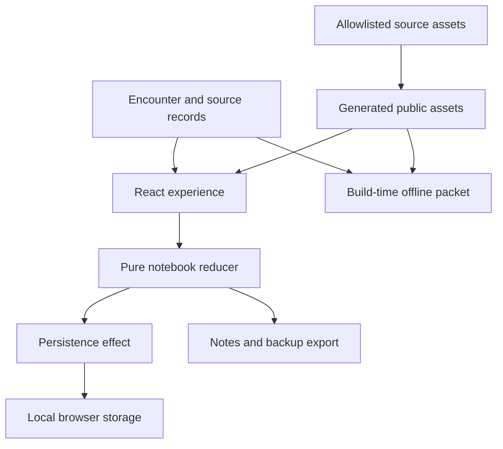

# At the Threshold — experience architecture

Status: implementation specification, not an implemented change. Prepared October 3, 2026.

Read with [Experience content specification](experience-content-spec.md) and [Coding-agent handoff](coding-agent-handoff.md). The earlier [remedy plan](early-christian-house-gathering-remedy-plan.md) explains the educational rationale.

## 1. Scope and authority

**Latest user instruction: build only the learning experience; the instructor will structure the assignment.** This specification therefore supersedes the earlier plan's requirements for an essay assignment, student rubric, graded completion, reflection composer, and Canvas submission flow. Do not implement those features or import those portions of the earlier document into the product.

The deliverable for the coding agent is a working, accessible, image-led experience within the existing React/Vite repository. Students encounter six situations, consider evidence, briefly record their thinking if they wish, revisit it, and optionally export their own notes.

| Implement in version 1 | Leave outside version 1 |
|---|---|
| Opening invitation and historical boundary | Assignment instructions, due dates, word counts, gradebooks, rubrics |
| All six existing images as encounter centers | A long-form reflection/essay editor |
| Meaningful choices and authored perspective feedback | Automated scoring, AI feedback, badges, learning-mastery claims |
| Historical source cards with limitations | Canvas API, submission buttons, LMS authentication or integration |
| Three deeper decision records and three short notes | Required personal testimony or religious participation |
| Local notebook, reconsideration, copy/download/backup | Accounts, database, cloud storage, analytics, live generated dialogue |
| A short closing reconsideration, entirely optional | An instructor dashboard or assignment configuration system |
| Equivalent text route and offline packet | New Blender characters, animation, video, or new image generation |

Keep the six original images. A schematic house diagram is optional and must not delay the core. Do not ship the current populated panorama as the default or as an unexplained substitute for an empty house. An interactive empty-house route belongs to a later enhancement, after the core has been tried with learners.

This handoff authorizes implementation design; it does not itself publish anything. A future coding agent should follow the user's actual instructions about committing, PR creation, and deployment. No request to create this documentation is permission to push to `main`.

## 2. Repository baseline

Repository: [early-Christian-house-gathering-Sol-5.6-Blender](https://github.com/wagy113/early-Christian-house-gathering-Sol-5.6-Blender).

Inspected baseline: [`f2fc8c5922ee9ab9d895ad1d07c6518eeb37ed49`](https://github.com/wagy113/early-Christian-house-gathering-Sol-5.6-Blender/tree/f2fc8c5922ee9ab9d895ad1d07c6518eeb37ed49). The implementation agent must inspect its actual checkout and reconcile drift before editing. The downloaded `work/repo` used for the design review is a selective source snapshot, not a complete Git checkout; do not use it as the implementation checkout.

At the reviewed revision:

- `src/App.jsx` owns all six content objects, three panorama rooms, dialogs, navigation, and a `house-evidence` local-storage array.
- Next/Previous in `step()` changes the selected image without the same visited-state update as `discover()`.
- There are no student writing controls or versioned notebook schema.
- React Three Fiber displays panorama textures; the large GLB is not loaded by this app component.
- `src/App.css` mixes viewer, dialog, and application styles. `src/index.css` contains global defaults.
- The project uses JavaScript/JSX, React, Vite, and Oxlint; the deployment workflow uses Node 22. Keep the existing lockfile discipline rather than upgrading the stack as a separate project.
- Both Vite and Jekyll workflows target Pages on `main`; the product needs one deployment route.

## 3. Architectural decisions

| ID | Decision | Reason |
|---|---|---|
| ADR-01 | Retain React/Vite, JavaScript, and static hosting. | The requested experience needs no server. Avoid a framework migration. |
| ADR-02 | Make semantic HTML encounter pages the primary interface. | Images, sources, and writing remain accessible without a 3D canvas. |
| ADR-03 | Separate authored content, student state, and presentation. | The same content can drive the app, notebook context, and offline packet. |
| ADR-04 | Use one reducer for persistent notebook changes; effects handle persistence. | Every navigation route and writing action follows the same rules. |
| ADR-05 | Use a small hash-based route parser. | Direct entry and reload work under a GitHub Pages project subpath without server rewrites. No router dependency is needed for this fixed route set. |
| ADR-06 | Use local browser saving with honest failure states and portable backups. | Preserve useful writing without accounts; never imply server submission or synchronization. |
| ADR-07 | Keep original assets in the repository; publish an explicit asset allowlist. | Source preservation should not make every Blender/model/video artifact part of the deployed site. |
| ADR-08 | Author deterministic branch feedback. | Historical nuance needs reviewable content, not unpredictable live generation. |

React documents reducers as a way to consolidate state transitions; the specific state contract below is this project's design. [React reducer guidance](https://react.dev/learn/extracting-state-logic-into-a-reducer).



Content flows into the app and packet. Student state stays in the browser and user-requested downloads. External historical pages are links for further reading; the required short source summaries are bundled locally.

## 4. User journey and routing

| Route | Purpose | Required behavior |
|---|---|---|
| `#/start` | Invitation, context, access options | Resume existing work or begin; one optional opening thought. |
| `#/encounter/letter` | E1 — arrival | Deep decision record. |
| `#/encounter/meal` | E2 — meal | Deep decision record; first implementation slice. |
| `#/encounter/reading` | E3 — reading | One short interpretive note. |
| `#/encounter/diversity` | E4 — status | One short interpretive note. |
| `#/encounter/care` | E5 — assistance | Deep decision record; recall E1 when available. |
| `#/encounter/pressure` | E6 — shrine/context | One short interpretive note with evidence-based corrective feedback. |
| `#/notebook` | Review/export personal notes | No essay task, rubric, grades, or submission status. |
| `#/closing` | Revisit initial thinking | Optional short reconsideration, revisit links, and note export. |

Parse only these whitelisted destinations. Empty hashes go to Start. Invalid or malformed hashes produce an accessible “That section was not found” message with a Start link; do not crash or erase state. Do not put student writing in a URL.

Use real hash links for navigation, allow browser Back/Forward, and centralize visit recording in the route-change handler. A visited encounter stays visited. Clicking Next, selecting contents, opening a deep link, and following Back must not invoke different progress logic. Avoid duplicate history pushes when already at the destination.

On a user-initiated route change, move focus to the new page's heading with `tabIndex=-1` and scroll there. Do not move focus for autosave, typing, source expansion, or progress updates. Maintain input state outside the route component so unmounting cannot discard it.

Recommended sequence is E1 through E6, but every encounter and the notebook remain available. At E6, Next becomes “Look back.” It never becomes “Submit assignment.” The opening and closing language is specified in the content file.

### Deep encounter interaction

1. Show the full image, optional description, reconstruction label, and situation.
2. Offer optional observation and assumption fields, a choice, and a brief reason.
3. “Consider another perspective” captures the first response once and reveals authored feedback and source cards. It works with blank fields and no choice. If no choice is selected, show the neutral feedback provided in the content record.
4. Show the captured response beside an editable “My thinking now” field and optional revised choice. “Still unsure” and retaining the same choice are valid.
5. Offer Next, contents, and notebook links. Nothing requires a minimum word count or a correct moral decision.

After the first capture, further thought goes into the current response; do not overwrite the first snapshot. A blank first snapshot remains blank. It is a record of what was entered at that moment, not proof the student had not previously read a source. A clarification can be written in current thinking.

### Brief encounter interaction

Show the situation, choice set, feedback, source cards, and one optional note. Persist the current selection and note. These three encounters do not demand separate before/after paragraphs. Feedback can change when a different choice is selected; every branch remains reviewable.

## 5. Presentation and accessibility

Aim for a calm visual encounter, not a dashboard or quiz. Lead with the image, readable typography, a short situation, and one primary action. Place the table of contents in a compact rail on desktop and a clearly labeled disclosure on mobile. All controls must remain usable without the image.

- Use the existing warm palette as a starting point, but verify text/control contrast. System fonts are sufficient.
- Display the full frame with natural aspect ratio. Avoid `object-fit: cover` cropping that removes the people or object under discussion. Provide optional enlargement using a native `<dialog>`.
- Keep original PNGs as sources. Responsive display variants should be visually checked against the originals for lost details, especially hands, scroll, food, and shrine.
- Choice controls are native radio groups with `fieldset` and `legend`; navigation uses links; writing fields have visible labels. Avoid click-only `div` controls.
- “Descriptions only” must stop rendering image elements, not merely hide them with CSS. Retain the reconstruction labels and complete long descriptions. If a preference cannot be saved, it still works for the current session.
- Do not preload all six images. Source text and writing controls must not wait on image loading.
- Provide image failure text and a direct link to the description. No essential fact is exclusively visual.
- No automatic motion, audio, timers, drag gestures, or hover-only information. Honor reduced motion for incidental transitions.
- Announce save failures and route changes appropriately; do not announce every keystroke or each successful autosave.
- Include skip navigation, visible focus, sensible heading order, and tested 320 CSS-pixel layout and 200% zoom. Required content should also reflow under more substantial browser zoom.

For optional enlargement, give the dialog a name, move focus into it, contain focus while open, support Escape, and return focus to the trigger. Core encounters must not be modal. [W3C modal-dialog pattern](https://www.w3.org/WAI/ARIA/apg/patterns/dialog-modal/).

## 6. Content contract

Use JavaScript ES modules that can also be imported by Node build scripts. Do not embed React elements, browser APIs, Vite-only environment reads, functions, or raw HTML in content records. Text fields are plain text; render paragraphs and links with normal React escaping.

| Module | Export | Required fields |
|---|---|---|
| `src/content/experience.js` | `experience` | ID, content version, title, central question, setting, disclosure, opening/closing copy, ordered encounter IDs. |
| `src/content/encounters.js` | `encounters` | Stable ID, E-number, title, kind (`deep`/`brief`), image paths, alt/long description, setting label, situation, observation prompt, choices, neutral feedback, source IDs, reconsideration/note prompt, image limitation, optional related encounter ID. |
| `src/content/sources.js` | `sources` | ID, author/work, passage, approximate setting, genre/purpose, attributed summary, limitation, URL. |

A choice has a stable ID, label, feedback, and a follow-up question. E6 may also carry `support: 'supported'` or `'unsupported'` to drive explanatory feedback, never a score. Deep encounters and E4 include a named alternative/uncertainty choice. The content specification fixes the IDs.

Image record fields: `originalPath`, generated `displayPath`, optional `srcSet`, `width`, `height`, `alt`, `description`. Paths are site-relative without a leading slash. The browser's asset helper prefixes `import.meta.env.BASE_URL`; the Node packet builder resolves paths on disk separately. Never put Windows review-workspace paths in deployed code.

Required content validation: exactly six unique encounter IDs in the declared order; three `deep` and three `brief`; unique choice IDs within an encounter; valid source and related-encounter references; nonempty neutral feedback, descriptions, and image-limit labels; existing image files; HTTPS source URLs; no placeholder content. A source card's expansion event means “opened,” not “read” or “understood.”

## 7. State and event contract

Use a pure reducer plus a small controller hook. Props/context can expose state to the routed page and notebook; a global-state library is unnecessary. Persistent state must not contain asset bytes, source HTML, UI loading states, or URLs derived from user input.

Example envelope after visiting the meal; this illustrates fields, not a completed learner response:

```json
{
  "schemaVersion": 1,
  "experienceId": "at-the-threshold",
  "contentVersion": "threshold-1",
  "updatedAt": "2026-10-03T18:00:00.000Z",
  "openingThought": "",
  "closingThought": "",
  "preferences": { "descriptionsOnly": false },
  "entries": {
    "meal": {
      "visited": true,
      "observation": "",
      "assumption": "",
      "choiceId": "reserve",
      "reason": "",
      "firstSnapshot": null,
      "perspectivesRevealed": false,
      "revisedChoiceId": null,
      "currentThinking": "",
      "note": "",
      "sourceIdsOpened": []
    }
  }
}
```

Initialize all six entries. Brief entries can use the same shape but expose only selection, reveal state, and note; do not create hidden extra requirements. `firstSnapshot`, when captured in a deep encounter, contains `observation`, `assumption`, `choiceId`, `reason`, and `capturedAt` copied by value.

| Event | Reducer behavior | Invariant |
|---|---|---|
| `VISIT_ENCOUNTER(id)` | Mark the valid entry visited. | Idempotent across all navigation routes. |
| `EDIT_FIELD(id, field, value)` | Update only a whitelisted writable text field. | Never replace the whole entry with partial form data. |
| `CHOOSE(id, choiceId)` | Set a valid choice; after deep capture, use the revised choice field. | The first snapshot remains unchanged. |
| `REVEAL_PERSPECTIVE(id, capturedAt)` | Set reveal state; capture a deep first snapshot only if it is null. | Repeat activation never overwrites the snapshot. |
| `OPEN_SOURCE(id, sourceId)` | Add a valid source ID once. | Does not mark a note recorded or claim reading. |
| `EDIT_OPENING`, `EDIT_CLOSING` | Update the relevant optional sentence field. | Not an essay draft or assessment requirement. |
| `SET_ACCESS_PREFERENCE` | Change the presentation preference. | Same evidence and choices remain available. |
| `RESTORE_VALIDATED_BACKUP` | Replace state only after import validation and explicit replacement confirmation. | Offer export of current in-memory work first. |
| `RESET_CONFIRMED` | Return this experience's state to a fresh envelope. | Does not clear other application storage. |

Pass timestamps through actions rather than generating them inside the reducer. Effects perform storage writes. Save initialization must finish before any write effect is enabled; React development effect re-runs must not overwrite an existing notebook with defaults.

Progress is derived, not independently persisted: `visitedCount` counts valid visited entries; `notesCount` counts entries with at least one non-whitespace learner text field. Choices alone and source-open events do not count as notes. Count each entry once. Suggested display: “4 of 6 encounters visited · notes in 2.” Do not gate Closing or call that count a grade, completion certificate, or mastery indicator.

## 8. Persistence, failures, and export

Storage key: `at-the-threshold:notebook:v1`. Do not silently migrate the old `house-evidence` array into the new notebook; it records clicks only. Leave that legacy key untouched unless the user explicitly chooses to clear legacy progress. New activity reset targets the new key only.

**Saving:** update React state immediately; debounce persistence for about 300 ms, and attempt a final write on field blur or ordinary in-app navigation. The current in-memory state remains exportable whether or not saving succeeds. Labels distinguish “Changes pending,” “Saved on this browser,” and “Not saved on this browser.” A successful API call is required before showing saved. Page exit events are supplementary, not a guarantee.

**Load/validation:** catch storage access and JSON parsing errors. Validate envelope type/version, experience ID, known IDs, booleans, arrays, and text types before use. Unknown/future schema versions and incompatible content versions must not be overwritten automatically. Offer the original raw stored value as a recovery download, with a choice to begin fresh after exporting. Cosmetic content edits need not bump `contentVersion`; changed meaning or removed choice IDs does.

**Unavailable storage:** retain current text, show the failure, and immediately offer Copy notes and Download notes. State plainly that reload/closing can lose unsaved text. Offer the offline packet so the learner can keep notes in their own document. Do not claim local saving is cross-device synchronization.

**Multiple tabs:** detect relevant `storage` events. If another tab changed the notebook, suspend automatic writes in this tab and offer exporting the current draft, then loading the saved version. Re-read the stored revision before a write when possible. Do not silently merge or promise perfect multi-tab synchronization; document the remaining race limitation and advise using one editing tab. Imported/restored states also pass through this conflict handling.

**Reset:** confirmation names the deletion, provides Export first, and has an easy Cancel. If removing the storage key fails, keep the old notebook in memory and report failure; do not claim a successful reset that will resurrect old text on reload. Do not use `localStorage.clear()`.

**Portable export:**

- Markdown/plain-text notes include title, setting, content version, encountered image IDs/titles, saved observations, first/current thinking, brief notes, and source references/URLs. Include opening/closing thoughts only if present. Escape formatting appropriately so student text cannot become active HTML in a preview.
- A JSON backup contains the validated envelope and can be re-imported. Accept only JSON under 1 MiB, only this experience, and supported versions; show a clear failure before changing anything. Build a new whitelisted object rather than spreading arbitrary imported keys. Reject oversized text instead of truncating it silently; a generous 20,000-character per-field limit is sufficient for this short-note experience and must be enforced visibly during input as well as import.
- Copy notes uses the clipboard when available and a selectable plain-text fallback when it is not. Downloads use in-memory Blob data; no upload endpoint is required. Revoke temporary object URLs after use.
- Export never includes a score, assignment prompt, suggested essay, instructor evaluation, or an assertion of Canvas submission.

## 9. Offline and JavaScript-failure path

Generate `experience-packet.html` from the same content records. It is a self-contained, text-first HTML file with inline CSS, all six detailed image descriptions, all choices and their labeled feedback, all source summaries/limits, and the opening/closing invitations. Use print-friendly note spaces; explicitly instruct offline learners to write on paper or in their own document. Do not present non-saving HTML text fields as a persistent notebook.

All branch responses may appear sequentially in the packet, with “Read the response for your selected option” instructions. This preserves the reasoning task without pretending a printed packet performs dynamic branching. External source links are optional further reading; the needed summaries remain present offline. The packet contains no assignment or grading material.

Link to it from the app and from a real `<noscript>` block in `index.html`; add a static recovery link that is visible if the app fails to initialize, not only when JavaScript is disabled. The downloaded packet must open under `file://` without network requests needed for its core text. Exported student notes and the content packet are separate files with different purposes.

## 10. Files and build assets

Proposed layout; smaller components are acceptable if these responsibility boundaries remain clear:

```text
src/
  App.jsx                         # shell and route-selected page
  App.css                         # shared experience layout/styles
  main.jsx
  index.css
  content/
    experience.js
    encounters.js
    sources.js
  components/
    StartPage.jsx
    EncounterPage.jsx
    SourceCard.jsx
    NotebookPage.jsx
    ClosingPage.jsx
    ImageDialog.jsx
  state/
    notebookReducer.js
    notebookSchema.js
    useNotebook.js
  lib/
    routes.js
    assetUrl.js
    notebookStorage.js
    notebookExport.js
scripts/
  validate-content.mjs
  prepare-public.mjs
  check-dist.mjs
tests/
  notebook.test.js
  content.test.js
  experience.spec.js
playwright.config.js               # browser specs only; starts local preview
docs/
  experience-architecture.md
  experience-content-spec.md
  coding-agent-handoff.md
  experience-verification.md        # actual implementation results
.generated/public/                 # generated, gitignored
```

Copy these three handoff documents into `docs/` when implementing. Their relative links will work together. If copying the older remedy plan too, keep it in that directory; otherwise remove the optional background link rather than leaving it broken. Do not convert this document into a repository-wide `AGENTS.md` or overwrite existing instructions.

Modify `src/App.jsx` and styles to remove the required panorama/dialog-first experience. Search the entire main app for consumers before removing unused `three`, `@react-three/fiber`, and `@react-three/drei` dependencies. Update `package-lock.json` with the package manager. Preserve Blender files, `public/models/`, panorama originals, and `hyperframes-tour/` as source artifacts; they are not in the version-1 deployment allowlist.

**Build asset strategy:** set Vite's `publicDir` to `.generated/public`. `prepare-public.mjs` creates that staging directory from an explicit allowlist, generates visually checked image variants and the packet, and copies only the favicon and other actually referenced small assets. It must run before both dev and production build. It may clear its own resolved staging directory, after checking that it is inside the repository, but never source assets or arbitrary paths.

Use a pinned build-time image library, such as `sharp`, only if a suitable tool is not already present. Keep processing local and deterministic; do not regenerate scene content or introduce network downloads. Store original source paths in the manifest. Suggested display widths: 640 and 1280 pixels; preserve exact originals separately. Start with a quality setting around 82 and visually inspect rather than treating that number as a quality guarantee. Link full-size originals only on explicit enlargement if they are included in the allowlist.

Suggested script contract:

```json
{
  "dev": "npm run prepare:public && vite",
  "prepare:public": "node scripts/prepare-public.mjs",
  "validate:content": "node scripts/validate-content.mjs",
  "build": "npm run validate:content && npm run prepare:public && vite build && node scripts/check-dist.mjs",
  "test": "node --test tests/notebook.test.js tests/content.test.js",
  "test:e2e": "playwright test",
  "lint": "oxlint",
  "preview": "vite preview"
}
```

These are scripts for the implementation agent to add and verify; they do not all exist now. Use explicit unit-test paths to avoid unintentionally running browser specs in the Node test runner. Configure Playwright with `testDir: './tests'` and `testMatch: '**/*.spec.js'` so it does not discover the Node unit tests. Its web-server setup must build and serve the production preview, or use an already verified production preview. A Playwright test dependency is justified for the navigation and writing-recovery journeys; do not add a second UI framework. Install its required browser in CI and document that prerequisite locally. Watch or rerun the preparation script when content or source assets change during development.

Retain relative base behavior unless real deployment testing requires a change. Hash routes leave the server request at the app entry. Use the asset helper consistently, fix any root-relative favicon path, and test the built app under the repository subpath. Vite's deployment documentation explains building `dist` and configuring Pages; verify the existing deployment rather than copying current sample action versions blindly. [Vite static deployment](https://vite.dev/guide/static-deploy.html).

Keep `.github/workflows/deploy-pages.yml` as the single Pages path; disable the Jekyll deployment workflow as part of the code change. Add lint, content validation, unit tests, and browser checks before deployment; use a separate PR verification job that has no deploy permissions if needed. The exact workflow design must respect current repository settings.

## 11. Implementation order

1. **Inspect and preserve.** Read applicable instructions, inspect status/branch/current files, reconcile differences from the baseline, and preserve unrelated work. Record decisions in the implementation verification document.
2. **Model the content and state.** Add stable records, schema validation, pure transitions, and save/export helpers. Check content references before wiring the interface.
3. **Deliver the meal slice.** Build E2 through observation, choice, reveal, reconsideration, notebook, export, and text equivalent. Verify reload recovery and keyboard operation before expanding.
4. **Finish all six encounters.** Apply the shared renderer, correct image descriptions, source cards, cross-encounter recall, opening, and closing. Supply all authored branches; do not leave placeholder content.
5. **Make failure paths work.** Finish storage errors, import/reset behavior, asset failure, offline packet, no-JavaScript route, and accessibility checks.
6. **Finish packaging and verification.** Prepare allowed assets, measure transfer sizes, run checks, inspect production preview under the project subpath, and update README/verification notes.

Do not block all independent implementation while waiting for a classroom pilot. A functioning candidate can be handed over for instructor review and student testing. Keep those statuses distinct from “code checks passed.” Build no empty-house enhancement until the image-led candidate is usable.

## 12. Acceptance and verification matrix

These are requirements to demonstrate later, not passed results from this documentation task.

| ID | Check | Passing evidence |
|---|---|---|
| A01 | Experience-only scope | No assignment page, grading/rubric UI, essay editor, Canvas integration, or submit action in any route, export, or packet. Optional brief notes and closing thought remain. |
| A02 | Six exact assets and records | Six stable IDs map to the six original image files; each has its own situation, feedback, sources, and limitation. |
| A03 | Route consistency | Direct entry, contents, Next/Previous, and browser Back/Forward yield consistent visited state. Invalid hashes are recoverable. |
| A04 | Before/after integrity | Revealing twice, changing routes, reload, and choosing again do not overwrite a deep encounter's first snapshot. Brief notes remain a single editable record. |
| A05 | Saving and recovery | Reload restores saved text; blocked/quota storage retains current text with an accurate warning and working export. Initial hydration never overwrites saved work. |
| A06 | Import, reset, conflicting data | Unsupported/malformed backup is rejected without mutation; cancel reset preserves text; failed reset is reported; detected external-tab changes suspend saving. |
| A07 | Keyboard and screen reader | All six encounters, sources, notes, closing, and export are usable; headings, groups, labels, focus return, and status behavior are manually checked. |
| A08 | Small-screen and visual presentation | At 320 CSS pixels and zoom, writing/controls stay reachable; full images are not unintentionally cropped; enlarged images retain detail. |
| A09 | Network/JavaScript failure | With images blocked, required text/choices/notes remain available. With JavaScript disabled or initialization broken, a usable packet link remains. Packet core works offline. |
| A10 | Equivalent content | The app and packet use the same six content records and include every branch's feedback and source limitation. No assignment text leaks from the old plan. |
| A11 | Portable notes | Export represents live text, including a pending save, opening/closing thoughts, first/current reasoning, and source references; JSON roundtrip preserves supported data. |
| A12 | Build and deployment | Lint, content checks, unit/browser tests, and production build pass; one Pages workflow; subpath reload/assets work. |
| A13 | Performance | Proposed budget: initial app plus first display image no more than 1.5 MiB transferred. Descriptions-only entry requests no images. No model, video, or 3D-library transfer. |
| A14 | Historical framing | Every image is labeled reconstruction; source cards preserve their separate settings; E6 corrects unwarranted conclusions without awarding points. |

For A13, record the tested browser, cache state, device/network emulation, transfer total, and time to a usable encounter. Target five seconds on an agreed throttled mobile profile; report measured results rather than a universal promise. `check-dist.mjs` should flag unintended GLB/Blender/video files and missing referenced assets in the actual deployment artifact.

Use focused unit tests for reducer invariants, malformed/future storage, content references, and JSON/export roundtrips. Use browser tests for complete navigation, reload preservation, simulated storage failures, packet fallback, and keyboard focus. A contrast scanner or automated accessibility check supplements manual assistive-technology testing; it does not replace it.

The handoff to the instructor should identify: changed files, launch commands, checked scenarios and results, known limitations, historical review still needed, and the version ready for a learner pilot. “All tests pass” does not establish learning effectiveness. No assignment needs to be written to finish this experience.
